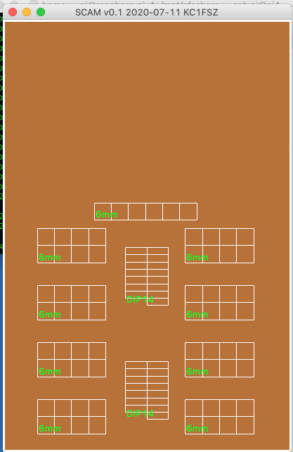
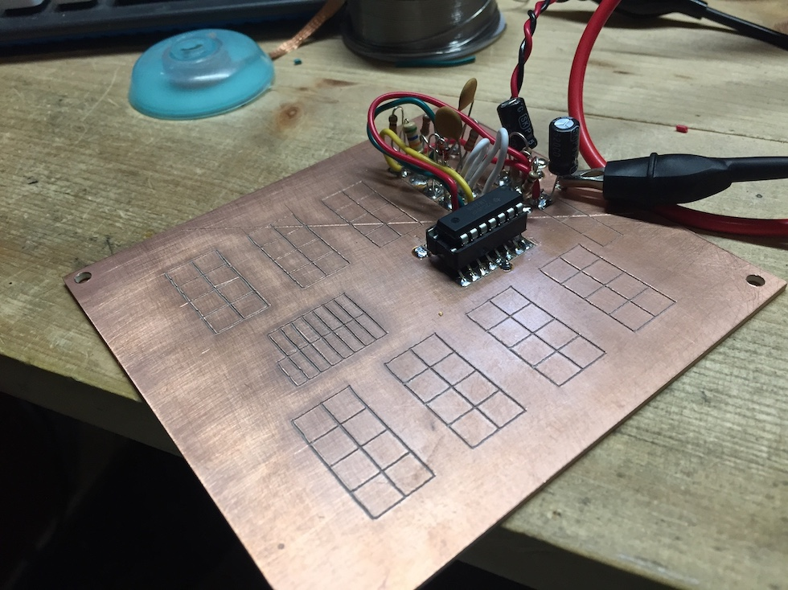

Overview
========
A very simple Python script for creating the G-Code commands for line-based PCB milling on a 3018 Pro CNC machine.

Contact
=======
Bruce MacKinnon KC1FSZ

Design:

Output board:

Commands
========

Transfer to milling machine:

        rsync -avzh out.nc bruce@192.168.8.80:/tmp

